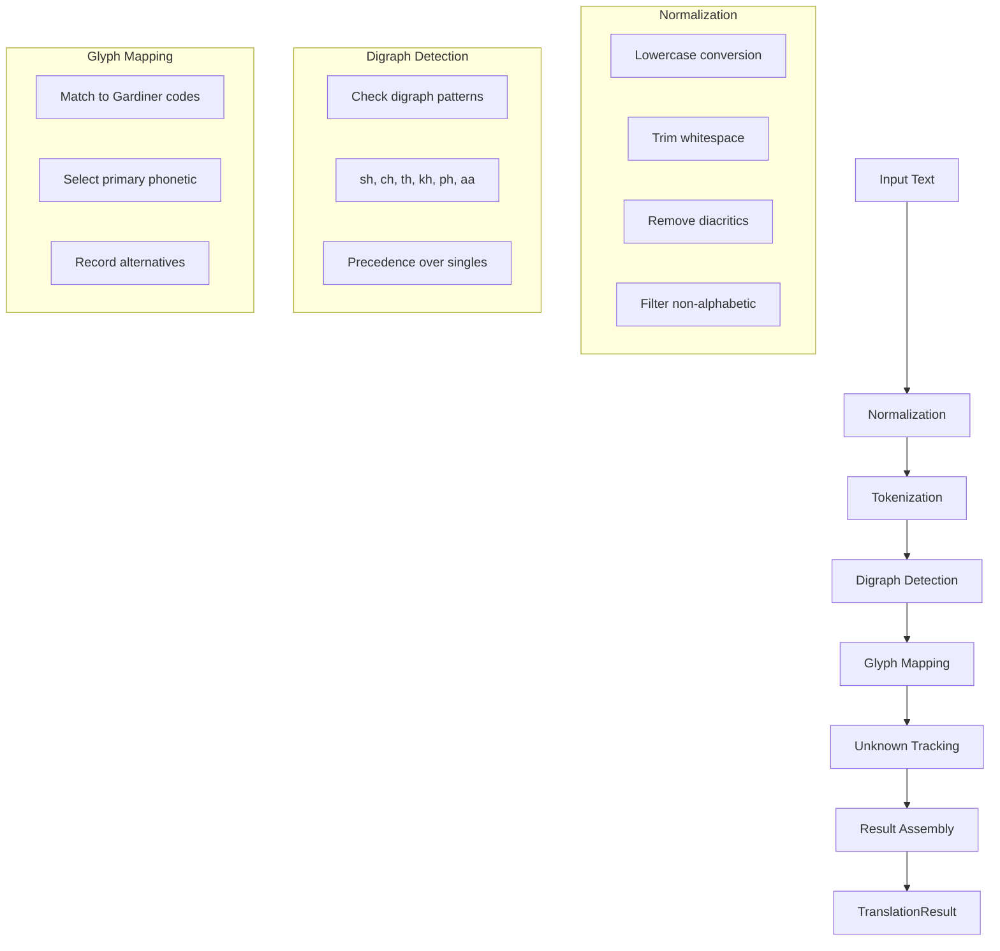
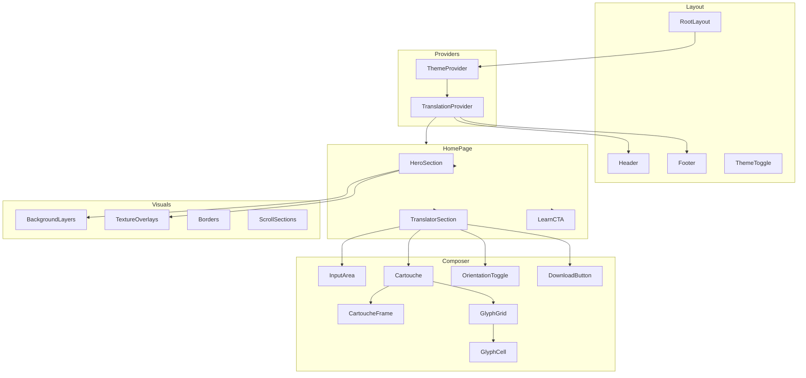
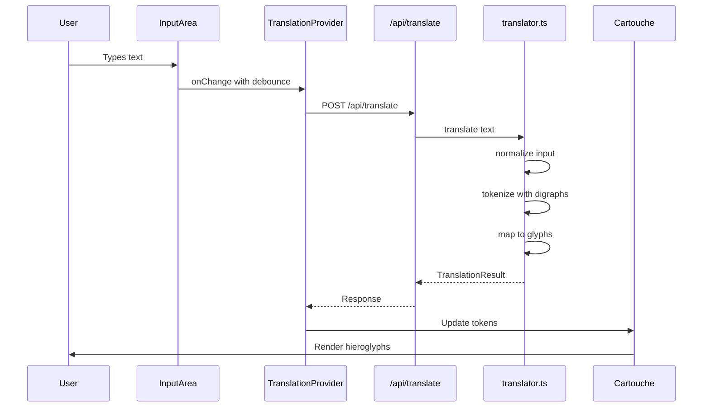

# The Digital Scribe 2.0 - Architecture Document

## Overview

**The Digital Scribe 2.0** is a museum-grade, scrollytelling web experience that translates modern text into Ancient Egyptian hieroglyphs displayed in a dynamically rendered cartouche. The design philosophy is "Neo-Ancient" - a hybrid of modern editorial design and ancient artifact aesthetics.

This document serves as the comprehensive blueprint for Phase 1: Foundation and Core Logic.

---

## Table of Contents

1. [Tech Stack](#tech-stack)
2. [Project Structure](#project-structure)
3. [Core Type Definitions](#core-type-definitions)
4. [Translation Engine Algorithm](#translation-engine-algorithm)
5. [Component Architecture](#component-architecture)
6. [Design System Specification](#design-system-specification)
7. [API Routes](#api-routes)
8. [Data Flow](#data-flow)
9. [Performance Considerations](#performance-considerations)

---

## Tech Stack

| Category | Technology | Purpose |
|----------|------------|---------|
| Framework | Next.js 14+ | App Router, Server Components, API Routes |
| Language | TypeScript | Strict mode enabled for type safety |
| Styling | Tailwind CSS v4 | CSS variables for theming, utility-first |
| Animation | Framer Motion | Smooth, performant animations |
| Icons | Lucide React | Consistent iconography |
| Export | html-to-image / satori | Cartouche image generation |

---

## Project Structure

```
/src
├── /app
│   ├── /api
│   │   ├── /translate
│   │   │   └── route.ts          # POST: Translate text to hieroglyphs
│   │   └── /glyphs
│   │       └── route.ts          # GET: Fetch glyph data
│   ├── /learn
│   │   ├── page.tsx              # Learning hub landing page
│   │   ├── /glyphs
│   │   │   └── page.tsx          # Hieroglyph encyclopedia
│   │   └── /gods
│   │       └── page.tsx          # Egyptian deities gallery
│   ├── page.tsx                  # Main translator page (Home)
│   ├── layout.tsx                # Root layout with providers
│   ├── globals.css               # Global styles and CSS variables
│   └── not-found.tsx             # Custom 404 page
│
├── /components
│   ├── /ui                       # Reusable UI primitives
│   │   ├── Button.tsx            # Themed button component
│   │   ├── Input.tsx             # Text input with Neo-Ancient styling
│   │   ├── Toggle.tsx            # Theme/orientation toggles
│   │   ├── Tooltip.tsx           # Hover information tooltips
│   │   ├── Card.tsx              # Base card component
│   │   └── index.ts              # Barrel export
│   │
│   ├── /composer                 # Translator composition components
│   │   ├── Cartouche.tsx         # Dynamic cartouche renderer
│   │   ├── CartoucheFrame.tsx    # Decorative cartouche border
│   │   ├── GlyphGrid.tsx         # Glyph display grid within cartouche
│   │   ├── GlyphCell.tsx         # Individual glyph cell
│   │   ├── InputArea.tsx         # Text input with character counter
│   │   ├── OrientationToggle.tsx # Horizontal/vertical toggle
│   │   ├── DownloadButton.tsx    # Export cartouche as image
│   │   ├── TranslationPreview.tsx # Live translation preview
│   │   └── index.ts              # Barrel export
│   │
│   ├── /visuals                  # Visual and decorative components
│   │   ├── Borders.tsx           # Decorative border patterns
│   │   ├── BackgroundLayers.tsx  # Parallax background system
│   │   ├── TextureOverlays.tsx   # Papyrus/stone texture overlays
│   │   ├── ScrollSections.tsx    # Scrollytelling section containers
│   │   ├── HeroSection.tsx       # Landing hero with animations
│   │   ├── ParallaxWrapper.tsx   # Scroll-based parallax effects
│   │   └── index.ts              # Barrel export
│   │
│   ├── /learn                    # Educational content components
│   │   ├── GlyphCard.tsx         # Individual glyph information card
│   │   ├── DeityCard.tsx         # God/goddess information card
│   │   ├── GlyphGrid.tsx         # Browsable glyph grid
│   │   ├── DeityCarousel.tsx     # Horizontal deity browser
│   │   ├── CategoryFilter.tsx    # Filter glyphs by category
│   │   ├── SearchBar.tsx         # Search glyphs/deities
│   │   └── index.ts              # Barrel export
│   │
│   ├── /layout                   # Layout components
│   │   ├── Header.tsx            # Site header with navigation
│   │   ├── Footer.tsx            # Site footer
│   │   ├── Navigation.tsx        # Main navigation menu
│   │   ├── ThemeToggle.tsx       # Light/dark theme switcher
│   │   └── index.ts              # Barrel export
│   │
│   └── /providers                # React context providers
│       ├── ThemeProvider.tsx     # Theme context and state
│       ├── TranslationProvider.tsx # Translation state management
│       └── index.ts              # Barrel export
│
├── /lib                          # Core logic and utilities
│   ├── translator.ts             # Translation engine
│   ├── glyphData.ts              # Hieroglyph database
│   ├── godsData.ts               # Egyptian deities database
│   ├── types.ts                  # TypeScript type definitions
│   ├── utils.ts                  # Utility functions
│   ├── constants.ts              # App-wide constants
│   └── hooks                     # Custom React hooks
│       ├── useTranslation.ts     # Translation hook
│       ├── useTheme.ts           # Theme hook
│       ├── useCartoucheExport.ts # Export functionality hook
│       └── index.ts              # Barrel export
│
├── /public
│   ├── /glyphs                   # SVG glyph assets (by Gardiner Code)
│   │   ├── /A                    # A-series (Man and his occupations)
│   │   ├── /B                    # B-series (Woman and her occupations)
│   │   ├── /C                    # C-series (Anthropomorphic deities)
│   │   ├── /D                    # D-series (Parts of the human body)
│   │   ├── /E                    # E-series (Mammals)
│   │   ├── /F                    # F-series (Parts of mammals)
│   │   ├── /G                    # G-series (Birds)
│   │   ├── /H                    # H-series (Parts of birds)
│   │   ├── /I                    # I-series (Amphibians, reptiles)
│   │   ├── /K                    # K-series (Fishes and parts of fishes)
│   │   ├── /L                    # L-series (Invertebrates)
│   │   ├── /M                    # M-series (Trees and plants)
│   │   ├── /N                    # N-series (Sky, earth, water)
│   │   ├── /O                    # O-series (Buildings)
│   │   ├── /P                    # P-series (Ships and parts of ships)
│   │   ├── /Q                    # Q-series (Domestic and funerary furniture)
│   │   ├── /R                    # R-series (Temple furniture, sacred emblems)
│   │   ├── /S                    # S-series (Crowns, dress, staves)
│   │   ├── /T                    # T-series (Warfare, hunting, butchery)
│   │   ├── /U                    # U-series (Agriculture, crafts)
│   │   ├── /V                    # V-series (Rope, fibre, baskets)
│   │   ├── /W                    # W-series (Vessels of stone and earthenware)
│   │   ├── /X                    # X-series (Loaves and cakes)
│   │   ├── /Y                    # Y-series (Writings, games, music)
│   │   ├── /Z                    # Z-series (Strokes and figures)
│   │   └── /Aa                   # Aa-series (Unclassified)
│   ├── /icons                    # App icons and favicons
│   │   ├── favicon.ico
│   │   ├── apple-touch-icon.png
│   │   └── og-image.png          # Open Graph image
│   ├── /textures                 # Background textures
│   │   ├── papyrus-light.webp
│   │   ├── papyrus-dark.webp
│   │   ├── stone-grain.webp
│   │   └── linen-pattern.webp
│   └── /fonts                    # Custom font files (if not using CDN)
│       ├── cinzel-regular.woff2
│       ├── cinzel-bold.woff2
│       └── fraunces-variable.woff2
│
├── /styles                       # Additional style modules
│   └── animations.css            # Complex keyframe animations
│
└── /config                       # Configuration files
    ├── site.ts                   # Site metadata configuration
    └── fonts.ts                  # Font configuration
```

---

## Core Type Definitions

All types are defined in [`/src/lib/types.ts`](src/lib/types.ts).

### IGlyph Interface

Represents a single hieroglyph with complete metadata.

```typescript
/**
 * Gardiner Sign List categories for hieroglyph classification
 */
export type GardinerCategory =
  | "A"  // Man and his occupations
  | "B"  // Woman and her occupations
  | "C"  // Anthropomorphic deities
  | "D"  // Parts of the human body
  | "E"  // Mammals
  | "F"  // Parts of mammals
  | "G"  // Birds
  | "H"  // Parts of birds
  | "I"  // Amphibians, reptiles
  | "K"  // Fishes and parts of fishes
  | "L"  // Invertebrates
  | "M"  // Trees and plants
  | "N"  // Sky, earth, water
  | "O"  // Buildings
  | "P"  // Ships and parts of ships
  | "Q"  // Domestic and funerary furniture
  | "R"  // Temple furniture, sacred emblems
  | "S"  // Crowns, dress, staves
  | "T"  // Warfare, hunting, butchery
  | "U"  // Agriculture, crafts
  | "V"  // Rope, fibre, baskets
  | "W"  // Vessels of stone and earthenware
  | "X"  // Loaves and cakes
  | "Y"  // Writings, games, music
  | "Z"  // Strokes and figures
  | "Aa"; // Unclassified

/**
 * Hieroglyph definition with Gardiner code, phonetic value, and metadata
 */
export interface IGlyph {
  /** Unique identifier (matches Gardiner code) */
  id: string;

  /** Gardiner Sign List code (e.g., "G1", "M17", "D21") */
  gardinerCode: string;

  /** Category from Gardiner classification */
  category: GardinerCategory;

  /** Phonetic value(s) this glyph can represent */
  phoneticValue: string[];

  /** Primary phonetic value for translation matching */
  primaryPhonetic: string;

  /** English name of the glyph */
  name: string;

  /** Detailed description of what the glyph depicts */
  description: string;

  /** Unicode code point if available */
  unicode?: string;

  /** Path to SVG asset (relative to /public/glyphs/) */
  svgPath: string;

  /** Alternative SVG variants if available */
  variants?: string[];

  /** Transliteration in Egyptological convention */
  transliteration: string;

  /** Tags for search and filtering */
  tags: string[];

  /** Whether this is a determinative (semantic classifier) */
  isDeterminative: boolean;

  /** Whether this is commonly used in phonetic spelling */
  isPhonetic: boolean;
}
```

### GlyphToken Interface

Represents a single token in the translation output.

```typescript
/**
 * Token type classification
 */
export type TokenType = 
  | "phonetic"      // Matched to a phonetic glyph
  | "unknown"       // No matching glyph found
  | "space"         // Word separator
  | "punctuation"   // Preserved punctuation
  | "determinative"; // Semantic classifier

/**
 * A single translation token linking source text to glyph
 */
export interface GlyphToken {
  /** Original source characters that produced this token */
  source: string;

  /** Type classification of this token */
  type: TokenType;

  /** Matched glyph data (null if unknown/space/punctuation) */
  glyph: IGlyph | null;

  /** Position index in the original input string */
  position: number;

  /** Length of source characters consumed */
  length: number;

  /** Confidence score for this match (0-1) */
  confidence: number;

  /** Alternative glyph matches if available */
  alternatives?: IGlyph[];
}
```

### TranslationResult Interface

Complete translation output with all metadata.

```typescript
/**
 * Orientation for glyph display
 */
export type CartoucheOrientation = "horizontal" | "vertical";

/**
 * Complete translation output with tokens and metadata
 */
export interface TranslationResult {
  /** Original input text */
  originalText: string;

  /** Normalized/processed input text */
  normalizedText: string;

  /** Array of translation tokens in order */
  tokens: GlyphToken[];

  /** Characters that could not be translated */
  unknownCharacters: string[];

  /** Total number of glyphs in result */
  glyphCount: number;

  /** Number of successfully translated characters */
  translatedCount: number;

  /** Number of unknown characters */
  unknownCount: number;

  /** Translation success rate (0-1) */
  successRate: number;

  /** Timestamp of translation */
  timestamp: Date;

  /** Suggested cartouche orientation based on content */
  suggestedOrientation: CartoucheOrientation;
}
```

### Additional Type Definitions

```typescript
/**
 * Egyptian deity representation for the learning section
 */
export interface IDeity {
  id: string;
  name: string;
  egyptianName: string;
  hieroglyphSpelling: string[];
  domain: string[];
  description: string;
  iconPath: string;
  associatedGlyphs: string[]; // Gardiner codes
  mythology: string;
}

/**
 * Theme configuration
 */
export type ThemeMode = "light" | "dark";

export interface ThemeConfig {
  mode: ThemeMode;
  colors: {
    primary: string;
    secondary: string;
    background: string;
    foreground: string;
    accent: string;
    muted: string;
    border: string;
  };
}

/**
 * Translation API request/response types
 */
export interface TranslateRequest {
  text: string;
  options?: {
    preservePunctuation?: boolean;
    maxLength?: number;
    orientation?: CartoucheOrientation;
  };
}

export interface TranslateResponse {
  success: boolean;
  result?: TranslationResult;
  error?: string;
}

/**
 * Glyph filter options for the learning section
 */
export interface GlyphFilter {
  category?: GardinerCategory;
  searchTerm?: string;
  isPhonetic?: boolean;
  isDeterminative?: boolean;
}

/**
 * Export options for cartouche image generation
 */
export interface ExportOptions {
  format: "png" | "svg" | "jpeg";
  scale: number;
  backgroundColor: string;
  includeFrame: boolean;
  orientation: CartoucheOrientation;
}
```

---

## Translation Engine Algorithm

The translation engine is implemented in [`/src/lib/translator.ts`](src/lib/translator.ts).

### Overview

The phonetic translation pipeline converts modern English text into Ancient Egyptian hieroglyphs using a phonetic mapping system. Since Ancient Egyptian and English have different phonetic systems, this is an approximation that prioritizes educational value and visual appeal.

### Pipeline Stages



### Stage 1: Input Normalization

```typescript
/**
 * Normalizes input text for consistent processing
 */
function normalizeInput(text: string): string {
  return text
    // Convert to lowercase
    .toLowerCase()
    // Trim leading/trailing whitespace
    .trim()
    // Remove diacritical marks (é → e, ñ → n)
    .normalize("NFD")
    .replace(/[\u0300-\u036f]/g, "")
    // Replace multiple spaces with single space
    .replace(/\s+/g, " ");
}
```

**Normalization Rules:**
1. **Lowercase**: All characters converted to lowercase for consistent matching
2. **Trim**: Remove leading and trailing whitespace
3. **Diacritics**: Remove accent marks using Unicode normalization
4. **Whitespace**: Collapse multiple spaces to single space
5. **Preserve**: Keep spaces between words for cartouche grouping

### Stage 2: Digraph Detection

Digraphs are two-letter combinations that map to a single hieroglyph. They must be detected before single-letter processing.

```typescript
/**
 * Ordered list of digraphs (checked before single letters)
 * Priority order matters - longer/more specific patterns first
 */
const DIGRAPHS: ReadonlyArray<string> = [
  "sh",  // ʃ sound - Maps to G43 (quail chick) or similar
  "ch",  // tʃ sound - Maps to Aa1 or similar
  "th",  // θ sound - Maps to D46 or similar  
  "kh",  // x sound - Maps to Aa1 or similar
  "ph",  // f sound - Maps to I9 (horned viper) for 'f'
  "aa",  // aː sound - Maps to G1 (vulture) doubled
  "qu",  // kw sound - Maps to Q3 + G43 or similar
  "oo",  // uː sound - Maps to G43 (quail chick)
  "ee",  // iː sound - Maps to M17 (reed) doubled
] as const;

/**
 * Tokenizes input with digraph precedence
 */
function tokenize(text: string): string[] {
  const tokens: string[] = [];
  let i = 0;
  
  while (i < text.length) {
    // Check for digraph match (two characters)
    if (i < text.length - 1) {
      const digraph = text.slice(i, i + 2);
      if (DIGRAPHS.includes(digraph)) {
        tokens.push(digraph);
        i += 2;
        continue;
      }
    }
    
    // Single character token
    tokens.push(text[i]);
    i += 1;
  }
  
  return tokens;
}
```

### Stage 3: Phonetic Mapping

Maps phonetic tokens to Gardiner codes using a lookup table.

```typescript
/**
 * Phonetic to Gardiner code mapping
 * Based on common Egyptological transliteration conventions
 */
const PHONETIC_MAP: Record<string, string> = {
  // Vowels (represented by semi-vowels in Egyptian)
  "a":  "G1",   // Vulture - Egyptian ꜣ (aleph)
  "e":  "M17",  // Reed - Egyptian j/i
  "i":  "M17",  // Reed - Egyptian j/i
  "o":  "G43",  // Quail chick - Egyptian w (approximation)
  "u":  "G43",  // Quail chick - Egyptian w
  
  // Consonants
  "b":  "D58",  // Foot - Egyptian b
  "c":  "V31",  // Basket with handle - Egyptian k (for hard c)
  "d":  "D46",  // Hand - Egyptian d
  "f":  "I9",   // Horned viper - Egyptian f
  "g":  "W11",  // Ring stand - Egyptian g
  "h":  "O4",   // Reed shelter - Egyptian h
  "j":  "D21",  // Mouth - approximation
  "k":  "V31",  // Basket with handle - Egyptian k
  "l":  "D21",  // Mouth - Egyptian r (no l in Egyptian)
  "m":  "G17",  // Owl - Egyptian m
  "n":  "N35",  // Water ripple - Egyptian n
  "p":  "Q3",   // Stool - Egyptian p
  "q":  "V31",  // Basket with handle - Egyptian q/k
  "r":  "D21",  // Mouth - Egyptian r
  "s":  "S29",  // Folded cloth - Egyptian s
  "t":  "X1",   // Bread loaf - Egyptian t
  "v":  "I9",   // Horned viper - approximation (use f)
  "w":  "G43",  // Quail chick - Egyptian w
  "x":  "V31",  // Basket - approximation (use k+s)
  "y":  "M17",  // Reed - Egyptian j
  "z":  "O34",  // Door bolt - Egyptian z
  
  // Digraphs
  "sh": "N37",  // Pool - Egyptian š
  "ch": "Aa1",  // Placenta - approximation
  "th": "D46",  // Hand - approximation (use d)
  "kh": "Aa1",  // Placenta - Egyptian ḫ
  "ph": "I9",   // Horned viper - use f sound
  "aa": "G1",   // Double vulture for long a
  "qu": "V31",  // Basket - use k
  "oo": "G43",  // Quail chick for long o/u
  "ee": "M17",  // Double reed for long e/i
};
```

### Stage 4: Glyph Resolution

```typescript
/**
 * Resolves a phonetic token to a full IGlyph object
 */
function resolveGlyph(
  token: string, 
  glyphDatabase: Map<string, IGlyph>
): IGlyph | null {
  const gardinerCode = PHONETIC_MAP[token];
  
  if (!gardinerCode) {
    return null;
  }
  
  return glyphDatabase.get(gardinerCode) || null;
}
```

### Stage 5: Result Assembly

```typescript
/**
 * Main translation function
 */
export function translate(
  input: string,
  glyphDatabase: Map<string, IGlyph>
): TranslationResult {
  const normalizedText = normalizeInput(input);
  const rawTokens = tokenize(normalizedText);
  
  const tokens: GlyphToken[] = [];
  const unknownCharacters: string[] = [];
  let position = 0;
  
  for (const rawToken of rawTokens) {
    if (rawToken === " ") {
      // Preserve spaces as word separators
      tokens.push({
        source: rawToken,
        type: "space",
        glyph: null,
        position,
        length: 1,
        confidence: 1,
      });
    } else {
      const glyph = resolveGlyph(rawToken, glyphDatabase);
      
      if (glyph) {
        tokens.push({
          source: rawToken,
          type: "phonetic",
          glyph,
          position,
          length: rawToken.length,
          confidence: 1,
        });
      } else {
        tokens.push({
          source: rawToken,
          type: "unknown",
          glyph: null,
          position,
          length: rawToken.length,
          confidence: 0,
        });
        unknownCharacters.push(rawToken);
      }
    }
    
    position += rawToken.length;
  }
  
  const glyphCount = tokens.filter(t => t.type === "phonetic").length;
  const translatedCount = glyphCount;
  const unknownCount = unknownCharacters.length;
  const totalProcessed = translatedCount + unknownCount;
  
  return {
    originalText: input,
    normalizedText,
    tokens,
    unknownCharacters: [...new Set(unknownCharacters)],
    glyphCount,
    translatedCount,
    unknownCount,
    successRate: totalProcessed > 0 ? translatedCount / totalProcessed : 0,
    timestamp: new Date(),
    suggestedOrientation: glyphCount > 10 ? "vertical" : "horizontal",
  };
}
```

### Complete Translation Flow Example

**Input:** `"Pharaoh"`

```
Step 1 - Normalize: "pharaoh"
Step 2 - Tokenize: ["ph", "a", "r", "a", "o", "h"]
Step 3 - Map:
  - "ph" → I9 (Horned viper)
  - "a"  → G1 (Vulture)
  - "r"  → D21 (Mouth)
  - "a"  → G1 (Vulture)
  - "o"  → G43 (Quail chick)
  - "h"  → O4 (Reed shelter)
Step 4 - Resolve: All glyphs found
Step 5 - Assemble: TranslationResult with 6 glyphs, 100% success rate
```

---

## Component Architecture

### Component Hierarchy



### Key Component Specifications

#### Cartouche Component

```typescript
// /src/components/composer/Cartouche.tsx

interface CartoucheProps {
  tokens: GlyphToken[];
  orientation: CartoucheOrientation;
  showFrame?: boolean;
  className?: string;
  onGlyphClick?: (token: GlyphToken) => void;
}

/**
 * Renders the translated glyphs within an authentic cartouche frame.
 * 
 * Features:
 * - Dynamic sizing based on glyph count
 * - Horizontal or vertical orientation
 * - Authentic cartouche border decoration
 * - Hover states showing glyph information
 * - Exportable as image
 */
```

#### GlyphCell Component

```typescript
// /src/components/composer/GlyphCell.tsx

interface GlyphCellProps {
  token: GlyphToken;
  size?: "sm" | "md" | "lg";
  showTooltip?: boolean;
  isInteractive?: boolean;
  onClick?: () => void;
}

/**
 * Individual glyph display cell with:
 * - SVG rendering with proper aspect ratio
 * - Hover tooltip with phonetic value and name
 * - Unknown character placeholder styling
 * - Animation on appearance
 */
```

#### InputArea Component

```typescript
// /src/components/composer/InputArea.tsx

interface InputAreaProps {
  value: string;
  onChange: (value: string) => void;
  maxLength?: number;
  placeholder?: string;
  className?: string;
}

/**
 * Styled text input for entering text to translate.
 * 
 * Features:
 * - Character counter with limit
 * - Neo-Ancient styled border
 * - Real-time translation trigger
 * - Debounced input handling
 */
```

---

## Design System Specification

### Neo-Ancient Design Philosophy

The "Neo-Ancient" design system bridges modern editorial aesthetics with ancient artifact authenticity. It evokes the feeling of discovering a museum artifact while maintaining modern usability standards.

### Color Palette

#### CSS Custom Properties

```css
/* /src/app/globals.css */

:root {
  /* ===== Deep Papyrus - Light Theme ===== */
  
  /* Primary: Rich gold reminiscent of tomb treasures */
  --color-primary: #C9A227;
  --color-primary-hover: #B8920F;
  --color-primary-muted: #C9A22733;
  
  /* Secondary: Deep lapis lazuli blue */
  --color-secondary: #1E3A5F;
  --color-secondary-hover: #152D4A;
  
  /* Background: Warm papyrus tones */
  --color-background: #F5F0E1;
  --color-background-alt: #EDE6D3;
  --color-background-elevated: #FFFBF0;
  
  /* Foreground: Deep, readable brown-black */
  --color-foreground: #2C2416;
  --color-foreground-muted: #5C5347;
  --color-foreground-subtle: #8B8378;
  
  /* Accent: Turquoise (faience) */
  --color-accent: #3DB8A0;
  --color-accent-hover: #2DA88F;
  
  /* Borders and dividers */
  --color-border: #D4C5A9;
  --color-border-strong: #B8A882;
  
  /* Semantic colors */
  --color-success: #4A7C59;
  --color-warning: #C9A227;
  --color-error: #A63D40;
  --color-info: #3E7CB1;
  
  /* Shadows */
  --shadow-sm: 0 1px 2px rgba(44, 36, 22, 0.05);
  --shadow-md: 0 4px 6px rgba(44, 36, 22, 0.07);
  --shadow-lg: 0 10px 15px rgba(44, 36, 22, 0.1);
  --shadow-inner: inset 0 2px 4px rgba(44, 36, 22, 0.05);
  
  /* Texture overlays */
  --texture-papyrus: url('/textures/papyrus-light.webp');
  --texture-grain: url('/textures/stone-grain.webp');
}

[data-theme="dark"] {
  /* ===== Lapis Lazuli Night - Dark Theme ===== */
  
  /* Primary: Bright gold on dark */
  --color-primary: #D4AF37;
  --color-primary-hover: #E5C048;
  --color-primary-muted: #D4AF3733;
  
  /* Secondary: Light blue accent */
  --color-secondary: #6B9BD2;
  --color-secondary-hover: #82ADE0;
  
  /* Background: Deep lapis blue-black */
  --color-background: #0F1419;
  --color-background-alt: #1A2332;
  --color-background-elevated: #243447;
  
  /* Foreground: Warm off-white */
  --color-foreground: #F0E6D3;
  --color-foreground-muted: #C4B89A;
  --color-foreground-subtle: #8B8378;
  
  /* Accent: Bright turquoise */
  --color-accent: #4ECDC4;
  --color-accent-hover: #5FE0D7;
  
  /* Borders */
  --color-border: #2D3B4F;
  --color-border-strong: #3D4F67;
  
  /* Shadows (lighter for dark mode) */
  --shadow-sm: 0 1px 2px rgba(0, 0, 0, 0.3);
  --shadow-md: 0 4px 6px rgba(0, 0, 0, 0.4);
  --shadow-lg: 0 10px 15px rgba(0, 0, 0, 0.5);
  --shadow-inner: inset 0 2px 4px rgba(0, 0, 0, 0.3);
  
  /* Texture overlays */
  --texture-papyrus: url('/textures/papyrus-dark.webp');
}
```

#### Tailwind Configuration

```typescript
// tailwind.config.ts

import type { Config } from "tailwindcss";

const config: Config = {
  content: [
    "./src/pages/**/*.{js,ts,jsx,tsx,mdx}",
    "./src/components/**/*.{js,ts,jsx,tsx,mdx}",
    "./src/app/**/*.{js,ts,jsx,tsx,mdx}",
  ],
  darkMode: ["class", '[data-theme="dark"]'],
  theme: {
    extend: {
      colors: {
        primary: "var(--color-primary)",
        "primary-hover": "var(--color-primary-hover)",
        "primary-muted": "var(--color-primary-muted)",
        secondary: "var(--color-secondary)",
        "secondary-hover": "var(--color-secondary-hover)",
        background: "var(--color-background)",
        "background-alt": "var(--color-background-alt)",
        "background-elevated": "var(--color-background-elevated)",
        foreground: "var(--color-foreground)",
        "foreground-muted": "var(--color-foreground-muted)",
        "foreground-subtle": "var(--color-foreground-subtle)",
        accent: "var(--color-accent)",
        "accent-hover": "var(--color-accent-hover)",
        border: "var(--color-border)",
        "border-strong": "var(--color-border-strong)",
      },
      boxShadow: {
        sm: "var(--shadow-sm)",
        md: "var(--shadow-md)",
        lg: "var(--shadow-lg)",
        inner: "var(--shadow-inner)",
      },
    },
  },
  plugins: [],
};

export default config;
```

### Typography

#### Font Families

| Role | Light Theme | Dark Theme | Fallback |
|------|-------------|------------|----------|
| Display/Headings | Cinzel | Cinzel | serif |
| Accent/Decorative | Fraunces | Fraunces | serif |
| Body Text | Crimson Text | Inter | system-ui |
| Monospace/Code | JetBrains Mono | JetBrains Mono | monospace |

#### Font Configuration

```typescript
// /src/config/fonts.ts

import { Cinzel, Fraunces, Crimson_Text, Inter, JetBrains_Mono } from "next/font/google";

export const cinzel = Cinzel({
  subsets: ["latin"],
  weight: ["400", "500", "600", "700"],
  variable: "--font-cinzel",
  display: "swap",
});

export const fraunces = Fraunces({
  subsets: ["latin"],
  weight: ["300", "400", "500", "600"],
  variable: "--font-fraunces",
  display: "swap",
});

export const crimsonText = Crimson_Text({
  subsets: ["latin"],
  weight: ["400", "600", "700"],
  style: ["normal", "italic"],
  variable: "--font-crimson",
  display: "swap",
});

export const inter = Inter({
  subsets: ["latin"],
  variable: "--font-inter",
  display: "swap",
});

export const jetbrainsMono = JetBrains_Mono({
  subsets: ["latin"],
  variable: "--font-mono",
  display: "swap",
});
```

#### Typography Scale

```css
/* Typography CSS Variables */
:root {
  /* Font Families */
  --font-display: var(--font-cinzel), "Times New Roman", serif;
  --font-accent: var(--font-fraunces), Georgia, serif;
  --font-body: var(--font-crimson), Georgia, serif;
  --font-mono: var(--font-mono), "Courier New", monospace;
  
  /* Font Sizes (fluid scaling) */
  --text-xs: clamp(0.75rem, 0.7rem + 0.25vw, 0.875rem);
  --text-sm: clamp(0.875rem, 0.8rem + 0.375vw, 1rem);
  --text-base: clamp(1rem, 0.9rem + 0.5vw, 1.125rem);
  --text-lg: clamp(1.125rem, 1rem + 0.625vw, 1.25rem);
  --text-xl: clamp(1.25rem, 1.1rem + 0.75vw, 1.5rem);
  --text-2xl: clamp(1.5rem, 1.3rem + 1vw, 2rem);
  --text-3xl: clamp(2rem, 1.6rem + 2vw, 3rem);
  --text-4xl: clamp(2.5rem, 2rem + 2.5vw, 4rem);
  --text-5xl: clamp(3rem, 2.5rem + 3vw, 5rem);
  
  /* Line Heights */
  --leading-tight: 1.2;
  --leading-normal: 1.5;
  --leading-relaxed: 1.75;
  
  /* Letter Spacing */
  --tracking-tight: -0.02em;
  --tracking-normal: 0;
  --tracking-wide: 0.05em;
  --tracking-wider: 0.1em;
}

[data-theme="dark"] {
  /* Dark mode uses Inter for body text for better screen readability */
  --font-body: var(--font-inter), system-ui, sans-serif;
}
```

### Texture and Material Effects

#### Texture Overlay System

```typescript
// /src/components/visuals/TextureOverlays.tsx

interface TextureOverlayProps {
  variant: "papyrus" | "stone" | "linen" | "aged";
  opacity?: number;
  blendMode?: "multiply" | "overlay" | "soft-light";
  className?: string;
}

/**
 * Applies authentic texture overlays for the Neo-Ancient aesthetic.
 * 
 * Variants:
 * - papyrus: Warm, fibrous texture for main surfaces
 * - stone: Subtle grain for carved/etched elements
 * - linen: Delicate weave pattern for backgrounds
 * - aged: Subtle wear and patina effects
 */
```

#### CSS Implementation

```css
/* Texture overlay classes */
.texture-papyrus {
  position: relative;
}

.texture-papyrus::after {
  content: "";
  position: absolute;
  inset: 0;
  background-image: var(--texture-papyrus);
  background-size: 300px 300px;
  opacity: 0.3;
  mix-blend-mode: multiply;
  pointer-events: none;
}

.texture-stone::after {
  background-image: var(--texture-grain);
  background-size: 200px 200px;
  opacity: 0.15;
  mix-blend-mode: overlay;
}

/* Cartouche-specific textures */
.cartouche-surface {
  background: linear-gradient(
    145deg,
    var(--color-background-elevated) 0%,
    var(--color-background) 50%,
    var(--color-background-alt) 100%
  );
  box-shadow:
    var(--shadow-lg),
    inset 0 1px 0 rgba(255, 255, 255, 0.1),
    inset 0 -1px 0 rgba(0, 0, 0, 0.1);
}

/* Decorative border patterns */
.border-hieroglyphic {
  border: 2px solid var(--color-border-strong);
  border-image: repeating-linear-gradient(
    90deg,
    var(--color-primary) 0px,
    var(--color-primary) 4px,
    transparent 4px,
    transparent 8px
  ) 2;
}
```

### Animation Specifications

#### Core Animations

```css
/* /src/styles/animations.css */

@keyframes glyph-appear {
  0% {
    opacity: 0;
    transform: translateY(10px) scale(0.9);
  }
  100% {
    opacity: 1;
    transform: translateY(0) scale(1);
  }
}

@keyframes cartouche-unfurl {
  0% {
    clip-path: inset(0 100% 0 0);
  }
  100% {
    clip-path: inset(0 0 0 0);
  }
}

@keyframes hieroglyph-shimmer {
  0% {
    background-position: -200% center;
  }
  100% {
    background-position: 200% center;
  }
}

@keyframes float {
  0%, 100% {
    transform: translateY(0);
  }
  50% {
    transform: translateY(-10px);
  }
}
```

#### Framer Motion Variants

```typescript
// /src/lib/animations.ts

export const glyphVariants = {
  hidden: {
    opacity: 0,
    y: 20,
    scale: 0.8,
  },
  visible: (i: number) => ({
    opacity: 1,
    y: 0,
    scale: 1,
    transition: {
      delay: i * 0.05,
      duration: 0.4,
      ease: [0.25, 0.46, 0.45, 0.94],
    },
  }),
};

export const cartoucheVariants = {
  hidden: {
    opacity: 0,
    scale: 0.95,
  },
  visible: {
    opacity: 1,
    scale: 1,
    transition: {
      duration: 0.6,
      ease: "easeOut",
      staggerChildren: 0.03,
    },
  },
};

export const scrollRevealVariants = {
  hidden: {
    opacity: 0,
    y: 50,
  },
  visible: {
    opacity: 1,
    y: 0,
    transition: {
      duration: 0.8,
      ease: [0.25, 0.46, 0.45, 0.94],
    },
  },
};
```

---

## API Routes

### POST /api/translate

Translates input text to hieroglyphs.

```typescript
// /src/app/api/translate/route.ts

import { NextRequest, NextResponse } from "next/server";
import { translate } from "@/lib/translator";
import { glyphDatabase } from "@/lib/glyphData";
import type { TranslateRequest, TranslateResponse } from "@/lib/types";

export async function POST(request: NextRequest): Promise<NextResponse<TranslateResponse>> {
  try {
    const body: TranslateRequest = await request.json();
    
    // Validate input
    if (!body.text || typeof body.text !== "string") {
      return NextResponse.json(
        { success: false, error: "Text is required" },
        { status: 400 }
      );
    }
    
    // Apply max length limit
    const maxLength = body.options?.maxLength ?? 100;
    const text = body.text.slice(0, maxLength);
    
    // Perform translation
    const result = translate(text, glyphDatabase);
    
    return NextResponse.json({
      success: true,
      result,
    });
  } catch (error) {
    console.error("Translation error:", error);
    return NextResponse.json(
      { success: false, error: "Translation failed" },
      { status: 500 }
    );
  }
}
```

### GET /api/glyphs

Retrieves glyph data for the learning section.

```typescript
// /src/app/api/glyphs/route.ts

import { NextRequest, NextResponse } from "next/server";
import { glyphDatabase, getAllGlyphs, getGlyphsByCategory } from "@/lib/glyphData";
import type { GardinerCategory, IGlyph } from "@/lib/types";

export async function GET(request: NextRequest) {
  const searchParams = request.nextUrl.searchParams;
  const category = searchParams.get("category") as GardinerCategory | null;
  const search = searchParams.get("search");
  const id = searchParams.get("id");
  
  // Single glyph by ID
  if (id) {
    const glyph = glyphDatabase.get(id);
    if (!glyph) {
      return NextResponse.json(
        { error: "Glyph not found" },
        { status: 404 }
      );
    }
    return NextResponse.json({ glyph });
  }
  
  // Filter by category
  let glyphs: IGlyph[] = category
    ? getGlyphsByCategory(category)
    : getAllGlyphs();
  
  // Apply search filter
  if (search) {
    const searchLower = search.toLowerCase();
    glyphs = glyphs.filter(
      (g) =>
        g.name.toLowerCase().includes(searchLower) ||
        g.phoneticValue.some((p) => p.includes(searchLower)) ||
        g.gardinerCode.toLowerCase().includes(searchLower)
    );
  }
  
  return NextResponse.json({ glyphs });
}
```

---

## Data Flow

### Translation Flow



### State Management

```typescript
// /src/components/providers/TranslationProvider.tsx

interface TranslationState {
  inputText: string;
  result: TranslationResult | null;
  isLoading: boolean;
  error: string | null;
  orientation: CartoucheOrientation;
}

interface TranslationContextValue extends TranslationState {
  setInputText: (text: string) => void;
  setOrientation: (orientation: CartoucheOrientation) => void;
  clearTranslation: () => void;
}
```

---

## Performance Considerations

### Optimization Strategies

1. **Server Components**: Use React Server Components for static content (learning pages, glyph data)

2. **Image Optimization**: 
   - SVG sprites for common glyphs
   - Next.js Image component for textures
   - WebP format for all raster images

3. **Translation Caching**:
   - Client-side memoization of translation results
   - Consider Redis caching for popular phrases

4. **Code Splitting**:
   - Dynamic imports for learning section components
   - Lazy load glyph data by category

5. **Bundle Optimization**:
   - Tree-shake unused Lucide icons
   - Subset fonts to used characters only

### Target Metrics

| Metric | Target | Notes |
|--------|--------|-------|
| LCP | < 2.5s | Largest Contentful Paint |
| FID | < 100ms | First Input Delay |
| CLS | < 0.1 | Cumulative Layout Shift |
| TTI | < 3.5s | Time to Interactive |
| Bundle Size | < 150KB | Initial JS bundle (gzipped) |

---

## Next Steps

After architecture approval, proceed with implementation in the following order:

1. **Phase 1.1**: Project setup, TypeScript types, and Tailwind configuration
2. **Phase 1.2**: Translation engine core logic with tests
3. **Phase 1.3**: Glyph database with initial phonetic mappings
4. **Phase 1.4**: UI components (Button, Input, Card, Tooltip)
5. **Phase 1.5**: Composer components (Cartouche, GlyphGrid, InputArea)
6. **Phase 1.6**: API routes and integration
7. **Phase 1.7**: Visual components and theming
8. **Phase 1.8**: Learning section pages

---

*Document Version: 1.0.0*  
*Last Updated: December 2024*  
*Author: Digital Scribe Architecture Team*